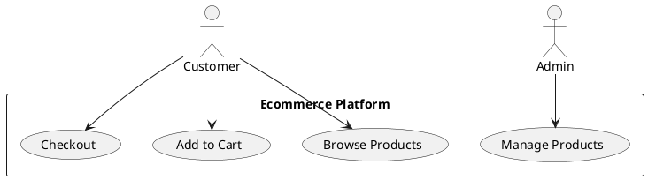
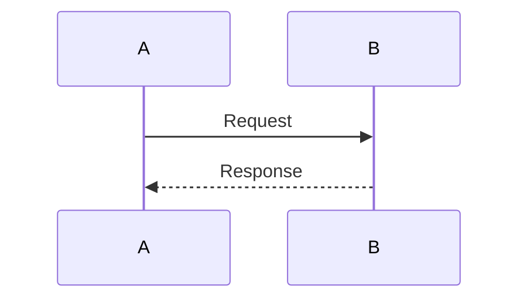

# Architecture Diagrams Overview

This document provides an overview of the architecture diagrams for the ecommerce platform, including diagram types, tools, and conventions.

## Diagram Types

### 1. C4 Model Diagrams

#### Level 1: System Context Diagram
**Purpose**: High-level overview showing the system and its relationships with external systems and users.

**Elements**:
- Ecommerce Platform (system boundary)
- External systems (Payment Gateway, Email Service, SMS Service, Shipping Provider, Analytics)
- Actors (Customer, Admin, Support Agent)

**File**: `c4-level1-system-context.png`

#### Level 2: Container Diagram
**Purpose**: Shows the high-level technology choices and how responsibilities are distributed across containers.

**Elements**:
- Web Application (React/Next.js)
- Mobile App (React Native)
- API Gateway (Kong)
- 8 Microservices (User, Product, Cart, Order, Payment, Inventory, Notification, Analytics)
- Message Broker (Kafka)
- Authentication Server (Keycloak)
- Monitoring Stack (Prometheus, Grafana, Jaeger, ELK)
- Databases (PostgreSQL cluster, Redis, Elasticsearch)

**File**: `c4-level2-container.png`

#### Level 3: Component Diagram
**Purpose**: Shows the internal components of each container.

**Elements** (per service):
- API Layer (Controllers)
- Business Logic Layer (Services)
- Data Access Layer (Repositories)
- Integration Layer (Event publishers/consumers)
- Cross-cutting Concerns (Exception handlers, validators, metrics)

**Files**:
- `c4-level3-component-user-service.png`
- `c4-level3-component-product-service.png`
- `c4-level3-component-order-service.png`

#### Level 4: Code Diagram
**Purpose**: Shows code-level details (classes, methods, relationships).

**Elements**:
- Entity classes with attributes
- Service classes with methods
- Repository interfaces
- Controller endpoints

**Files**:
- `c4-level4-code-user-entity.png`
- `c4-level4-code-order-service.png`

### 2. UML Diagrams

#### Class Diagrams
**Purpose**: Shows the structure of the system by modeling classes, their attributes, operations, and relationships.

**Examples**:
- `uml-class-user-domain.png` - User domain model
- `uml-class-order-domain.png` - Order domain model
- `uml-class-product-domain.png` - Product domain model

**Elements**:
- Classes with attributes and methods
- Relationships (association, aggregation, composition, inheritance)
- Multiplicity indicators

#### Sequence Diagrams
**Purpose**: Shows how objects interact in a particular scenario, emphasizing the time ordering of messages.

**Examples**:
- `uml-sequence-order-creation.png` - Order creation workflow
- `uml-sequence-payment-processing.png` - Payment processing
- `uml-sequence-user-registration.png` - User registration

**Elements**:
- Participants (objects/services)
- Lifelines
- Messages (synchronous, asynchronous, return)
- Activation bars
- Notes and constraints

#### State Diagrams
**Purpose**: Shows the states an object can be in and the transitions between those states.

**Examples**:
- `uml-state-order-status.png` - Order status state machine
- `uml-state-payment-status.png` - Payment status state machine
- `uml-state-user-status.png` - User status state machine

**Elements**:
- States (initial, final, intermediate)
- Transitions with events/conditions
- Actions (entry, exit, do)
- Guard conditions

#### Use Case Diagrams
**Purpose**: Shows the functionality provided by the system in terms of actors, their goals, and dependencies.

**Examples**:
- `uml-use-case-customer.png` - Customer use cases
- `uml-use-case-admin.png` - Administrator use cases
- `uml-use-case-support.png` - Support agent use cases

**Elements**:
- Actors (stick figures)
- Use cases (ovals)
- Relationships (association, include, extend, generalization)
- System boundary

### 3. Database Diagrams

#### Entity-Relationship (ER) Diagrams
**Purpose**: Shows the relationships between entities in a database.

**Examples**:
- `er-diagram-user-db.png` - User database schema
- `er-diagram-order-db.png` - Order database schema
- `er-diagram-product-db.png` - Product database schema

**Elements**:
- Entities (rectangles)
- Attributes (ovals)
- Relationships (diamonds)
- Cardinality (1:1, 1:N, M:N)
- Primary keys, foreign keys

#### Schema Diagrams
**Purpose**: Shows the database schema with tables, columns, and relationships.

**Examples**:
- `schema-diagram-user-tables.png` - User service tables
- `schema-diagram-order-tables.png` - Order service tables
- `schema-diagram-inventory-tables.png` - Inventory service tables

**Elements**:
- Tables with columns
- Data types and constraints
- Primary keys (PK)
- Foreign keys (FK)
- Indexes

### 4. Other Diagrams

#### Component Diagrams
**Purpose**: Shows the organization and dependencies among software components.

**Examples**:
- `component-diagram-microservices.png` - Microservices components
- `component-diagram-api-gateway.png` - API Gateway components
- `component-diagram-monitoring-stack.png` - Monitoring stack components

**Elements**:
- Components (rectangles with stereotype)
- Interfaces (provided/required)
- Dependencies
- Ports

#### Deployment Diagrams
**Purpose**: Shows the physical deployment of software artifacts on hardware nodes.

**Examples**:
- `deployment-diagram-development.png` - Development environment
- `deployment-diagram-production.png` - Production environment
- `deployment-diagram-kubernetes.png` - Kubernetes deployment

**Elements**:
- Nodes (hardware/software execution environments)
- Artifacts (executable files, libraries, configuration files)
- Communication paths
- Deployment specifications

#### Data Flow Diagrams (DFD)
**Purpose**: Shows how data flows through a system.

**Examples**:
- `data-flow-order-processing.png` - Order processing data flow
- `data-flow-payment-processing.png` - Payment processing data flow
- `data-flow-inventory-update.png` - Inventory update data flow

**Elements**:
- Processes (circles)
- Data stores (parallel lines)
- External entities (rectangles)
- Data flows (arrows)

## Diagram Tools

### 1. Draw.io / diagrams.net
**Purpose**: General-purpose diagramming tool for all diagram types.

**Features**:
- Web-based and desktop versions
- Extensive shape libraries
- Export to PNG, SVG, PDF, XML
- Integration with Google Drive, GitHub, etc.

**Usage**:
```xml
<!-- Example draw.io XML structure -->
<mxfile>
  <diagram name="Page-1">
    <mxGraphModel>
      <root>
        <mxCell id="0"/>
        <mxCell id="1" parent="0"/>
        <!-- Diagram elements -->
      </root>
    </mxGraphModel>
  </diagram>
</mxfile>
```

### 2. PlantUML
**Purpose**: Text-based UML diagram generation.

**Features**:
- Write diagrams in plain text
- Integration with documentation (Markdown, AsciiDoc)
- Version control friendly
- Supports sequence, class, use case, state, component diagrams

**Examples**:


### 3. Mermaid
**Purpose**: Markdown-inspired diagram generation.

**Features**:
- Write diagrams in Markdown-like syntax
- Integration with GitHub, GitLab, documentation
- Supports flowcharts, sequence diagrams, class diagrams, state diagrams, etc.

**Examples**:


```mermaid
sequenceDiagram
    participant C as Customer
    participant A as API Gateway
    participant O as Order Service
    participant P as Payment Service
    participant I as Inventory Service
    
    C->>A: POST /api/v1/orders
    A->>O: Create order
    O->>I: Reserve inventory
    I-->>O: Inventory reserved
    O->>P: Process payment
    P-->>O: Payment successful
    O-->>A: Order created
    A-->>C: Order confirmation
```

### 4. Lucidchart
**Purpose**: Professional diagramming tool.

**Features**:
- Collaborative diagramming
- Templates for architecture diagrams
- Integration with Confluence, Jira, etc.
- Real-time collaboration

### 5. Microsoft Visio
**Purpose**: Enterprise diagramming tool.

**Features**:
- Professional templates
- Advanced shape libraries
- Integration with Office 365
- Stencils for architecture diagrams

## Diagram Conventions

### Naming Convention

#### File Naming
```
<diagram-type>-<level>-<subject>-<description>.<extension>
```

**Examples**:
- `c4-level1-system-context.png`
- `c4-level2-container.png`
- `c4-level3-component-user-service.png`
- `uml-sequence-order-creation.png`
- `er-diagram-user-db.png`
- `deployment-diagram-production.png`

#### Diagram Type Codes
- `c4` - C4 model diagram
- `uml` - UML diagram
- `er` - Entity-relationship diagram
- `schema` - Database schema diagram
- `component` - Component diagram
- `deployment` - Deployment diagram
- `data-flow` - Data flow diagram

### Color Scheme

#### Standard Colors
- **Blue (#3498db)**: Services, components
- **Green (#2ecc71)**: Databases, data stores
- **Orange (#e67e22)**: External systems
- **Purple (#9b59b6)**: APIs, interfaces
- **Red (#e74c3c)**: Errors, warnings, critical paths
- **Gray (#95a5a6)**: Infrastructure, supporting components

#### Status Colors
- **Green (#27ae60)**: Active, running, success
- **Yellow (#f1c40f)**: Warning, degraded, in progress
- **Red (#c0392b)**: Error, stopped, failure
- **Blue (#2980b9)**: Default, neutral

### Styling Guidelines

#### Shapes
- **Rectangles with rounded corners**: Services, applications
- **Cylinders**: Databases
- **Clouds**: External systems
- **Stick figures**: Actors/users
- **Arrows with solid lines**: Synchronous communication
- **Arrows with dashed lines**: Asynchronous communication
- **Dotted lines**: Optional/dependency relationships

#### Text
- **Bold**: Main titles, important elements
- **Normal**: Descriptions, details
- **Italic**: Optional elements, notes
- **Monospace**: Code, technical terms

#### Sizing
- **Large**: Main system components
- **Medium**: Supporting components
- **Small**: Details, annotations

### Version Control

#### Diagram Files
- Store source files (`.drawio`, `.puml`, `.mmd`) in version control
- Export rendered images (`.png`, `.svg`) for documentation
- Keep both source and rendered versions

#### Change Management
- Update diagrams when architecture changes
- Document diagram changes in commit messages
- Review diagram updates in code reviews

#### Directory Structure
```
docs/diagrams/
├── c4-model/
│   ├── level1-system-context.drawio
│   ├── level1-system-context.png
│   ├── level2-container.drawio
│   ├── level2-container.png
│   └── ...
├── uml/
│   ├── class-diagrams/
│   ├── sequence-diagrams/
│   ├── state-diagrams/
│   └── use-case-diagrams/
├── database/
│   ├── er-diagrams/
│   └── schema-diagrams/
├── other/
│   ├── component-diagrams/
│   ├── deployment-diagrams/
│   └── data-flow-diagrams/
└── templates/
    ├── c4-template.drawio
    ├── uml-template.puml
    └── mermaid-template.mmd
```

## Creating Diagrams

### Step-by-Step Process

#### 1. Planning
1. **Identify purpose**: What should the diagram communicate?
2. **Determine audience**: Who will use the diagram?
3. **Select diagram type**: Which type best serves the purpose?
4. **Define scope**: What level of detail is needed?
5. **Gather information**: Collect requirements, specifications, existing documentation

#### 2. Drafting
1. **Create rough sketch**: Paper or whiteboard sketch
2. **Identify main elements**: Key components, relationships
3. **Organize layout**: Logical grouping, flow direction
4. **Add details**: Attributes, methods, constraints
5. **Review with stakeholders**: Get feedback early

#### 3. Refining
1. **Create digital version**: Using selected tool
2. **Apply styling**: Colors, shapes, fonts
3. **Add annotations**: Labels, notes, legends
4. **Check consistency**: Follow conventions, standards
5. **Validate accuracy**: Ensure diagram matches reality

#### 4. Finalizing
1. **Export formats**: PNG for documentation, SVG for editing
2. **Add to documentation**: Update README, architecture docs
3. **Version control**: Commit source and rendered files
4. **Communicate changes**: Notify team of updates
5. **Schedule reviews**: Regular diagram maintenance

### Best Practices

#### Clarity
- **Keep it simple**: Focus on essential information
- **Use consistent terminology**: Same terms as code/documentation
- **Avoid clutter**: Remove unnecessary details
- **Group related elements**: Logical organization
- **Use whitespace**: Improve readability

#### Accuracy
- **Match reality**: Diagrams should reflect actual implementation
- **Update regularly**: Keep diagrams current with changes
- **Validate with code**: Cross-check with source code
- **Document assumptions**: Note any simplifications or abstractions
- **Version diagrams**: Track changes over time

#### Maintainability
- **Use templates**: Consistent styling across diagrams
- **Modular design**: Break complex diagrams into smaller ones
- **Source control**: Store diagram source files
- **Automate generation**: Where possible (PlantUML, Mermaid)
- **Regular reviews**: Schedule diagram maintenance

#### Collaboration
- **Share early**: Get feedback during drafting
- **Use collaborative tools**: Real-time editing where possible
- **Document decisions**: Why certain elements were included/excluded
- **Establish ownership**: Who maintains each diagram
- **Training**: Ensure team knows how to create/read diagrams

## Diagram Examples

### Example 1: C4 Level 2 Container Diagram

**Description**: Shows the main containers and their relationships.

**Key Elements**:
- Web Application (React/Next.js)
- API Gateway (Kong)
- Microservices (8 services)
- Message Broker (Kafka)
- Authentication (Keycloak)
- Databases (PostgreSQL, Redis, Elasticsearch)
- Monitoring (Prometheus, Grafana, Jaeger, ELK)

**Relationships**:
- Web App → API Gateway (HTTP)
- API Gateway → Microservices (HTTP)
- Microservices → Databases (JDBC/ODBC)
- Microservices → Kafka (events)
- Microservices → Keycloak (OAuth2)
- Monitoring tools ← Microservices (metrics/logs/traces)

### Example 2: Sequence Diagram - Order Creation

**Description**: Shows the sequence of interactions when a customer creates an order.

**Participants**:
- Customer
- Web Application
- API Gateway
- Order Service
- Inventory Service
- Payment Service
- Kafka
- Notification Service

**Sequence**:
1. Customer submits order via Web App
2. Web App sends request to API Gateway
3. API Gateway routes to Order Service
4. Order Service validates order
5. Order Service calls Inventory Service to reserve stock
6. Inventory Service confirms reservation
7. Order Service calls Payment Service to process payment
8. Payment Service confirms payment
9. Order Service publishes "OrderCreated" event to Kafka
10. Notification Service consumes event and sends confirmation
11. Order Service returns success to API Gateway
12. API Gateway returns success to Web App
13. Web App shows confirmation to Customer

### Example 3: ER Diagram - User Database

**Description**: Shows the entity-relationship model for the user database.

**Entities**:
- User (id, email, username, first_name, last_name, status, created_at, updated_at)
- Address (id, user_id, street, city, state, zip_code, country, is_default)
- PaymentMethod (id, user_id, type, token, last_four, expiry_date, is_default)
- Role (id, name, description)
- UserRole (user_id, role_id) - junction table

**Relationships**:
- User (1) → (N) Address (one-to-many)
- User (1) → (N) PaymentMethod (one-to-many)
- User (N) → (N) Role (many-to-many via UserRole)

## Tools and Resources

### Online Resources

#### Diagram Templates
- [C4 Model Templates](https://github.com/structurizr/dsl)
- [UML Diagram Examples](https://www.uml-diagrams.org/)
- [AWS Architecture Icons](https://aws.amazon.com/architecture/icons/)
- [Azure Architecture Icons](https://docs.microsoft.com/en-us/azure/architecture/icons/)
- [Google Cloud Architecture Icons](https://cloud.google.com/icons)

#### Learning Resources
- [C4 Model Website](https://c4model.com/)
- [UML Specification](https://www.omg.org/spec/UML/)
- [PlantUML Documentation](https://plantuml.com/)
- [Mermaid Documentation](https://mermaid-js.github.io/mermaid/)
- [Draw.io Tutorials](https://www.drawio.com/doc/)

### Recommended Tools by Use Case

#### Quick Sketches
- **Whiteboard/Paper**: Initial brainstorming
- **Excalidraw**: Digital whiteboard with hand-drawn style
- **Miro**: Collaborative online whiteboard

#### Formal Documentation
- **Draw.io/diagrams.net**: General-purpose, free
- **Lucidchart**: Professional, collaborative
- **Microsoft Visio**: Enterprise, Windows-based

#### Text-Based Diagrams
- **PlantUML**: UML diagrams from text
- **Mermaid**: Markdown-like diagram syntax
- **Graphviz**: Graph visualization from DOT language

#### Code-First Approach
- **Structurizr**: C4 model from code annotations
- **Kroki**: Diagram-as-code service
- **Diagrams**: Python diagram as code

## Maintenance and Evolution

### Diagram Lifecycle

#### 1. Creation
- Identify need for new diagram
- Gather requirements and information
- Create initial version
- Review with stakeholders
- Publish to documentation

#### 2. Usage
- Reference in documentation
- Use in presentations
- Share with team members
- Train new team members

#### 3. Maintenance
- Regular reviews (quarterly)
- Update when architecture changes
- Fix errors and inconsistencies
- Improve clarity and readability

#### 4. Retirement
- Archive obsolete diagrams
- Mark as deprecated
- Redirect to updated versions
- Remove from active documentation

### Quality Checklist

#### Before Publishing
- [ ] Diagram serves clear purpose
- [ ] Audience is clearly defined
- [ ] All essential elements included
- [ ] No unnecessary clutter
- [ ] Consistent styling applied
- [ ] Terminology matches code/docs
- [ ] Relationships are accurate
- [ ] Labels are clear and concise
- [ ] Legend/key included if needed
- [ ] Version information included

#### During Reviews
- [ ] Technical accuracy verified
- [ ] Stakeholder feedback incorporated
- [ ] Consistency with other diagrams
- [ ] Readability for intended audience
- [ ] Compliance with conventions
- [ ] Source files stored in version control
- [ ] Export formats generated
- [ ] Documentation updated with references

### Automation Opportunities

#### Diagram Generation
```bash
# Generate PlantUML diagrams from code
plantuml -tpng sequence.puml

# Generate Mermaid diagrams in Markdown
# Embedded in Markdown files

# Generate C4 diagrams from Structurizr DSL
structurizr-cli export -workspace workspace.dsl -format plantuml
```

#### Documentation Integration
```markdown
# In Markdown documentation

```

#### CI/CD Pipeline
```yaml
# GitHub Actions example
jobs:
  generate-diagrams:
    runs-on: ubuntu-latest
    steps:
      - uses: actions/checkout@v3
      - name: Generate diagrams
        run: |
          npm install -g @mermaid-js/mermaid-cli
          mmdc -i input.mmd -o output.png
      - name: Upload diagrams
        uses: actions/upload-artifact@v3
        with:
          name: diagrams
          path: '*.png'
```

## Conclusion

Effective architecture diagrams are essential for understanding, communicating, and maintaining complex software systems. By following the conventions and best practices outlined in this document, you can create diagrams that are clear, accurate, and maintainable.

Remember that diagrams are living documents that should evolve with the system. Regular maintenance and updates are crucial to ensure diagrams remain valuable resources for the team.

**Last Updated**: April 2024
**Version**: 1.0.0